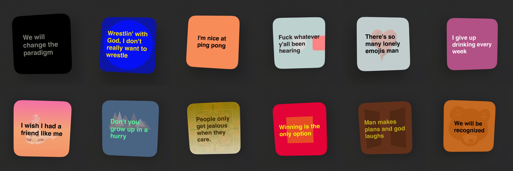
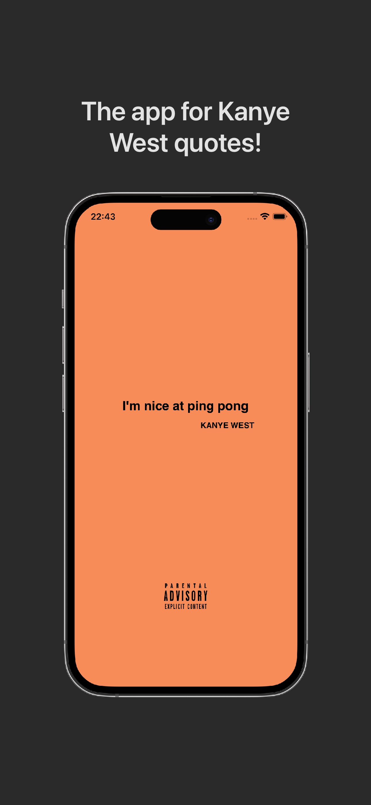
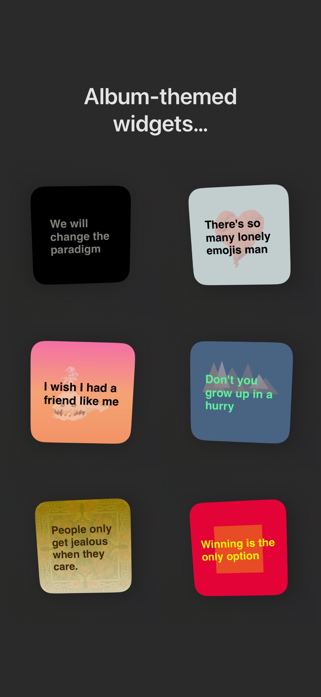
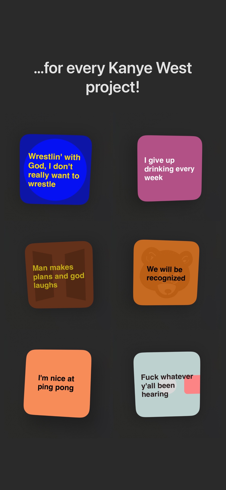

<h2>React Native App and Swift Widgets for Kanye West quotes!</h2>

> "Name one genius that ain't crazy..."

- <a href="https://apps.apple.com/app/ye-said/id6463562198">App Store</a>
- <a href="https://play.google.com/store/apps/details?id=com.bpstudios.yesaid">Google Play Store</a>

<h3>App & Widgets</h3>
This is an expo project ejected to be managed in Xcode. A flutter project is under construction. Each iOS widget is an individual extension (which is necesarry to have individual widget titles and descriptions). The iOS widget files can be found <a href="./ios-widgets">here</a>.

The main app is written with JavaScript in App.js. Run in an React Native Expo environment (or any environment that would support App.js) to test. (Android and iOS) I can't upload the entire project since there is confindental information in the files, such as apple developer IDs and more.

<h3>Api</h3>
View the quotes, and corresponding php script to fetch them, <a href="./server-side">here</a>.

<h3>More</h3>
Feel free to contribute! I wrote instructions for the widget design <a href="./android-widgets/README.md">here</a>.

Meanwhile peep these preview images:

  
  
  

